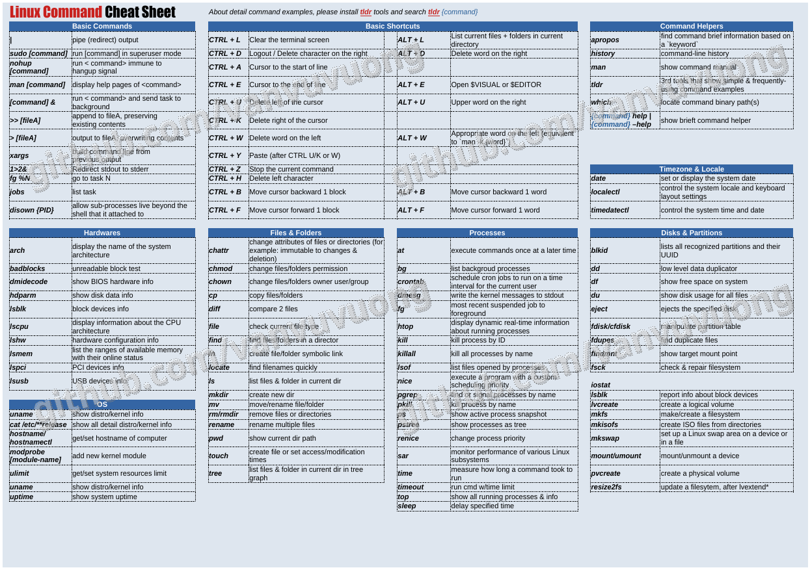

<h1>Hello there, I'm a Cloud Engineer. Sadly to say, most of my repos are private!</h1>

<h2>👋 Tran Dinh Dong's Github Stats </h2>

  
  

  

<h1>Working with Technology Stacks</h1>

  
  
  
  
  
  
  
  
  

<h1>Cẩm nang lập trình viên thực dụng xem thêm <a href="https://github.com/vanvuvuong/ltvtd">tại đây</a>.</h1>
<h1>Checking out my curate Linux commands cheatsheet. PDF file in <a href="files/Linux Commands.pdf">here</a>.</h1>

